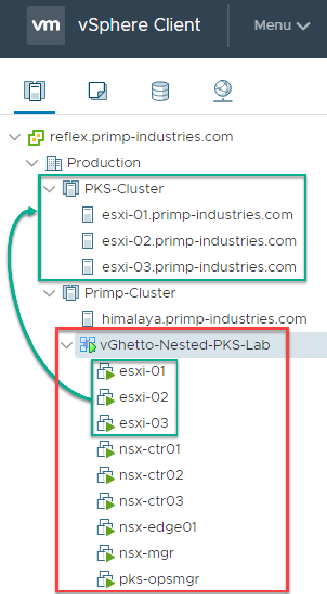

# vGhetto Automated PKS Lab Deployment


## Table of Contents

* [Description](#description)
* [Changelog](#changelog)
* [Requirements](#requirements)
* [Configuration](#configuration)
* [Logging](#logging)
* [Sample Execution](#sample-execution)

## Description

Automated deployment of the infrastructure (Nested ESXi including VSAN storage, NSX-T & Pivotal Ops Manager) required for configuring Pivotal Container Service (PKS) using PowerCLI. You just need a vCenter Server 6.5 or greater endpoint along with a single physical ESXi host to deploy the infrastructure to. For information, you can refer to this blog post [here](http://www.virtuallyghetto.com/2018/06/vghetto-automated-pivotal-container-service-pks-lab-deployment.html) for more details.

Below is an screenshot of an example deployment:



## Changelog

## Requirements
* vCenter Server endpoint running at least vSphere 6.5 or later
* Windows system that supports PowerCLI
* [PowerCLI 10.1](https://code.vmware.com/web/dp/tool/vmware-powercli/10.1.0)
* Download [pks-vghetto-lab-deployment.ps1](pks-vghetto-lab-deployment.ps1) script
* Nested ESXi [6.5d](https://download3.vmware.com/software/vmw-tools/nested-esxi/Nested_ESXi6.5d_Appliance_Template_v1.0.ova) or [6.5 Update 1](https://download3.vmware.com/software/vmw-tools/nested-esxi/Nested_ESXi6.5u1_Appliance_Template_v1.0.ova) Virtual Appliance OVA
* NSX-T 2.1
  * [NSX-T 2.1 Manager for ESXi OVA](https://my.vmware.com/group/vmware/details?downloadGroup=NSX-T-210&productId=673&download=true&fileId=ceb09d4c2a044e745be0e5ab7f698295&secureParam=4faa362cd30eda7241a9471ee692774b&uuId=e268e430-59fd-45f2-a7c4-08629fe084ef&downloadType=)
  * [NSX-T 2.1 Controller for ESXi OVA](https://my.vmware.com/group/vmware/details?downloadGroup=NSX-T-210&productId=673&download=true&fileId=46f4cf5fa854bcd4f2c74f849e7acb69&secureParam=852f862526f99ea5f73fda3fb455ca14&uuId=e7c7f09a-3567-4aa4-9c80-d30bdae030fe&downloadType=)
  * [NSX-T 2.1 Edge For ESXi OVA](https://my.vmware.com/group/vmware/details?downloadGroup=NSX-T-210&productId=673&download=true&fileId=46bdb3be8b48cdea045eed660a9d68d0&secureParam=35cf3c9f5f143fd48a74afd1773cde7f&uuId=dd993136-275e-43b6-83e7-6ba10fec89ac&downloadType=)
* [Pivotal Ops Manager 2.1.5](https://network.pivotal.io/products/ops-manager)

## Configuration

This section describes the credentials to your vCenter Server in which the PKS lab environment will be deployed to:
```console
$VIServer = "vcenter.primp-industries.com"
$VIUsername = "primp"
$VIPassword = "-->MySuperDuperSecurePassword<--"
```

This section describes the location of the files required for deployment. All five variables are mandatory.

```console
$NestedESXiApplianceOVA = "C:\Users\primp\Desktop\Nested_ESXi6.5u1_Appliance_Template_v1.ova"
$NSXTManagerOVA = "C:\Users\primp\Desktop\nsx-unified-appliance-2.1.0.0.0.7395503.ova"
$NSXTControllerOVA = "C:\Users\primp\Desktop\nsx-controller-2.1.0.0.0.7395493.ova"
$NSXTEdgeOVA = "C:\Users\primp\Desktop\nsx-edge-2.1.0.0.0.7395502.ova"
$PKSOpsMgrOVA = "C:\Users\primp\Desktop\pcf-vsphere-2.1-build.318.ova"
```

This section describes the Ops Manage configuration
```console
$OpsManagerDisplayName = "pks-opsmgr"
$OpsManagerHostname = "pks-opsmgr.primp-industries.com"
$OpsManagerIPAddress = "172.30.51.19"
$OpsManagerNetmask = "255.255.255.0"
$OpsManagerGateway = "172.30.51.1"
$OpsManagerAdminPassword = "VMware1!"
```

This section defines the number of Nested ESXi VMs to deploy along with their associated IP Address(s). The names are merely the display name of the VMs when deployed. At a minimum, you should deploy at least three hosts, but you can always add additional hosts and the script will automatically take care of provisioning them correctly.
```console
$NestedESXiHostnameToIPs = @{
"esxi-01" = "172.30.51.10"
"esxi-02" = "172.30.51.11"
"esxi-03" = "172.30.51.12"
}
```

This section describes the resources allocated to each of the Nested ESXi VM(s). Depending on the deployment type, you may need to increase the resources. For Memory and Disk configuration, the unit is in GB.
```console
$NestedESXivCPU = "2"
$NestedESXivMEM = "24" #GB
$NestedESXiCachingvDisk = "4" #GB
$NestedESXiCapacityvDisk = "60" #GB
```

This section describes the location as well as the generic networking settings applied to the Nested ESXi, NSX-T & Ops Manager VMs.
```console
$VirtualSwitchType = "VDS" # VSS or VDS
$VMNetwork = "dv-vlan3251"
$VMDatastore = "himalaya-local-SATA-dc3500-3"
$VMNetmask = "255.255.255.0"
$VMGateway = "172.30.51.1"
$VMDNS = "172.30.0.100"
$VMNTP = "pool.ntp.org"
$VMPassword = "VMware1!"
$VMDomain = "primp-industries.com"
$VMSyslog = "172.30.51.170"
# Applicable to Nested ESXi only
$VMSSH = "true"
$VMVMFS = "false"
# Applicable to VC Deployment Target only
$RootDatacenterName = "Production"
$VMCluster = "Primp-Cluster"
```

This section describes the new vSphere Cluster which will be created for PKS Compute Cluster
```console
$NewVCVSANClusterName = "PKS-Cluster"
```

This section describes the general NSX-T configurations and most of the defaults can be left alone outside of the environmental specific configurations such as **NSXPrivatePortgroup** property.
```console
$DeployNSX = 1
$NSXRootPassword = "VMware1!"
$NSXAdminUsername = "admin"
$NSXAdminPassword = "VMware1!"
$NSXAuditUsername = "audit"
$NSXAuditPassword = "VMware1!"
$NSXSSHEnable = "true"
$NSXEnableRootLogin = "true"
$NSXPrivatePortgroup = "dv-private"
$NSXIntermediateNetworkPortgroup = "dv-vlan3250"
```

This section describes the two IP Pools: Tunnel Endpoint for ESXi host and Load Balancer Pool for K8s
```console
$TunnelEndpointPoolName = "ESXi-VTEP-Pool"
$TunnelEndpointPoolDescription = "Tunnel Endpoint for ESXi Transport Nodes"
$TunnelEndpointPoolIPRangeStart = "192.168.1.10"
$TunnelEndpointPoolIPRangeEnd = "192.168.1.30"
$TunnelEndpointPoolCIDR = "192.168.1.0/24"
$TunnelEndpointPoolGateway = "192.168.1.1"

$LoadBalancerPoolName = "Load-Balancer-Pool"
$LoadBalancerPoolDescription = "Load Balancer IP Pool"
$LoadBalancerPoolIPRangeStart = "10.20.0.10"
$LoadBalancerPoolIPRangeEnd = "10.20.0.50"
$LoadBalancerPoolCIDR = "10.20.0.0/24"
```

This section describes the IP Block used for K8s workload
```console
$ipBlockName = "PKS-IP-Block"
$ipBlockNetwork = "172.16.0.0/16"
```

This section describes the Transport Zones that will be created
```console
$OverlayTransportZoneName = "TZ-Overlay"
$OverlayTransportZoneHostSwitchName = "Hostswitch1-OVERLAY"
$VlanTransportZoneName = "TZ-VLAN"
$VlanTransportZoneNameHostSwitchName = "Hostswitch2-VLAN"
```

This section describes the Uplink Profile that will be used for Edge VMs (just make sure you properly map the VM Networks when you deploy the Edge VM. Refer to blog post for more details)
```console
$ESXiUplinkProfileName = "ESXi-Uplink-Profile"
$ESXiUplinkProfilePolicy = "FAILOVER_ORDER"
$ESXiUplinkProfileActivepNIC = "vmnic2"
$ESXiUplinkProfileTransportVLAN = "0"
$ESXiUplinkProfileMTU = "1600"

$EdgeUplinkProfileName = "Edge-Uplink-Profile"
$EdgeUplinkProfilePolicy = "FAILOVER_ORDER"
$EdgeUplinkProfileActivepNIC = "uplink-1"
$EdgeUplinkProfileTransportVLAN = "0"
$EdgeUplinkProfileMTU = "1600"
$EdgeUplinkProfileOverlayvNIC = "fp-eth0"
$EdgeUplinkProfileVlanvNIC = "fp-eth1"
```

This section describes the Logical Switches that will be created for both K8s Mgmt & Uplink
```console
$K8SMgmtClusterLogicalSwitchName = "K8S-Mgmt-Cluster-LS"
$K8SMgmtClusterLogicalSwitchReplicationMode = "MTEP"
$UplinkLogicalSwitchName = "Uplink-LS"
$UplinkLogicalSwitchVlan = "0"
```

This section describes the name fo the Edge Cluster
```console
$EdgeClusterName = "Edge-Cluster-01"
```

This section describes the T0 Router that will be created. This assumes you will be using static route to provide connectivity to NSX env rather than BGP
```console
$T0LogicalRouterName = "T0-LR"
$T0LogicalRouterEdgeCluster = $EdgeClusterName
$T0LogicalRouterHAMode = "ACTIVE_STANDBY"
$T0UplinkRouterPortName = "Uplink-1"
$T0UplinkRouterPortLS = $UplinkLogicalSwitchName
$T0UplinkRouterPortSwitchPortName = "Uplink-1-Port"
$T0UplinkRouterPortIP = "172.30.50.2"
$T0UplinkRouterPortIPPrefix = "24"
$T0UplinkRouterStaticRouteNetwork = "0.0.0.0/0"
$T0UplinkRouterStaticRouteNextHop = "172.30.50.1"
```

This section describes the T1 Router that will be created for K8s Mgmt along with the up/down links
```console
$T1LogicalRouterName = "T1-K8S-Mgmt-Cluster"
$T1LogicalRouterEdgeCluster = $EdgeClusterName
$T1LogicalRouterHAMode = "ACTIVE_STANDBY"
$T1LogicalRouterFailOverMode = "PREEMPTIVE"
$T1LinkedRouterPortLS = $K8SMgmtClusterLogicalSwitchName
$T1LinkedRouterPortNameOnT0 = "LinkedPort_K8S-Mgmt-Cluster"
$T1LinkedRouterPortNameOnT1 = "LinkedPort_T0-LR"
$T1DownlinkRouterPortSwitchPortName = "Downlink-1-Port"
$T1DownlinkRouterPortNameOnT1 = "Downlink-1"
$T1DownlinkRouterPortIP = "10.10.0.1"
$T1DownlinkRouterPortIPPrefix = "24"
```

This section describes the NSX-T Manager configuration. Currently, the re-sizing of the VM has not been enabled but will be possible in the future. For now, you can simply adjust the Hostname/IP Address.
```console
$NSXTMgrDeploymentSize = "small"
$NSXTMgrvCPU = "2"
$NSXTMgrvMEM = "8"
$NSXTMgrDisplayName = "nsx-mgr"
$NSXTMgrHostname = "nsx-mgr.primp-industries.com"
$NSXTMgrIPAddress = "172.30.51.13"
```

This section describes the NSX-T Controller configuration. You can deploy N-number of Controllers by simply adding entries to the hash table. Currently, the re-sizing of the VM has not been enabled but will be possible in the future.
```console
$NSXTCtrvCPU = "2"
$NSXTCtrvMEM = "6"
$NSXControllerSharedSecret = "s3cR3ctz"
$NSXTControllerHostnameToIPs = @{
"nsx-ctr01" = "172.30.51.14"
"nsx-ctr02" = "172.30.51.15"
"nsx-ctr03" = "172.30.51.16"
}
```

This section describes the NSX-T Edge configuration. You can deploy N-number of Edges by simply adding entries to the hash table. Currently, the re-sizing of the VM has not been enabled but will be possible in the future.
```console
$NSXTEdgevCPU = "8"
$NSXTEdgevMEM = "16"
$NSXTEdgeHostnameToIPs = @{
"nsx-edge01" = "172.30.51.17"
}
```

Once you have saved your changes, you can now run the PowerCLI script as you normally would.

## Logging

There is additional verbose logging that outputs as a log file in your current working directory called **pks-vghetto-lab-deployment.log** which can be useful for debugging purposes.

## Sample Execution

Here is an example deployment:


If everything is succesful, you should be able to login to the NSX-T Manager to confirm all the network deployments. You should be able to login to your Ops Manager instance and start your PKS deployment workflows.